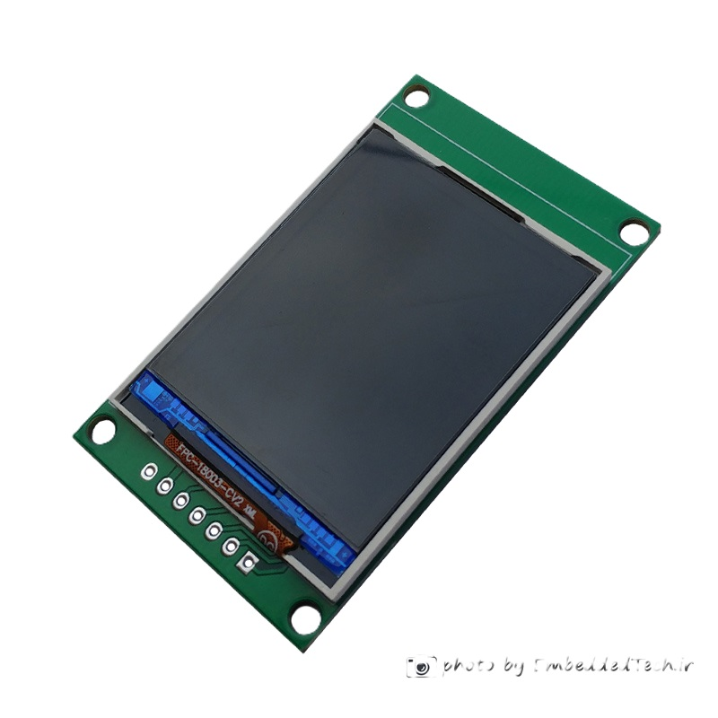

# STM32 Nokia LCD Tutorials

This repository contains a series of STM32 projects demonstrating how to interface with the Nokia ST7735 LCD module.  
Each folder represents a separate tutorial or example for different functionalities of the LCD.

## 📂 Folder Structure

- **Nokia1661_TFT/**
  - **image_from_flash/** – Display images stored in STM32 flash memory

## 🧰 Requirements

- STM32CubeIDE
- STM32F103C8 
- Nokia 1.8" spfd54124b LCD module   

## ⚙️ Notes

- Some LCD modules may use **BGR** color order instead of **RGB**. Adjust the display driver configuration if colors appear incorrect.

## 📸 Preview

